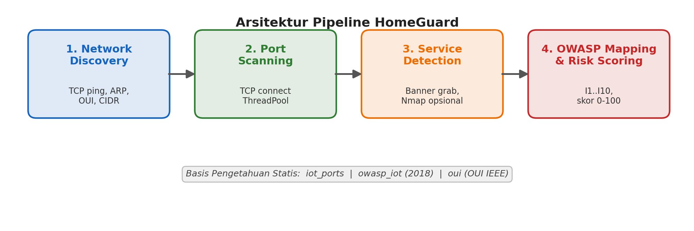
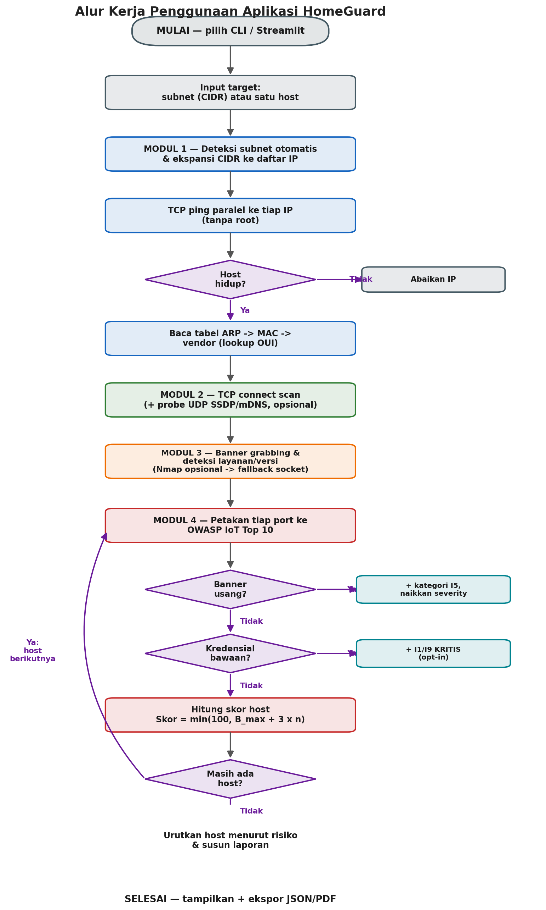

<h1 align="center">🛡️ HomeGuard</h1>

<p align="center">
  <em>Pemindai keamanan jaringan rumah untuk identifikasi kerentanan perangkat IoT,<br>
  dipetakan ke OWASP IoT Top 10 (2018) dengan skor risiko 0–100.</em>
</p>

<p align="center">
  <a href="https://github.com/gerrard046/HomeGuard/actions/workflows/ci.yml">
    </a>
  
  
  
  
  
  
  
</p>

---

**Pemindai keamanan jaringan rumah untuk mengidentifikasi kerentanan perangkat
IoT pada jaringan Wi-Fi domestik**, dengan pemetaan ke kerangka **OWASP IoT
Top 10 (2018)** dan penilaian skor risiko 0–100.

Proyek ini adalah prototipe implementasi paper tugas kuliah
(**Politeknik Siber dan Sandi Negara**) dengan metode *Research and
Development* (R&D) pendekatan *prototyping*.

> ⚠️ **PERINGATAN ETIKA**
> Gunakan HomeGuard **HANYA pada jaringan milik sendiri atau yang Anda miliki
> izin eksplisit** untuk memindainya. Pemindaian jaringan tanpa izin dapat
> melanggar hukum dan etika. Alat ini ditujukan untuk **edukasi dan pengujian
> defensif** (*non-intrusive, semi-active scanner* tanpa eksploitasi).

---

## Daftar Isi

1. [Apa itu HomeGuard](#apa-itu-homeguard)
2. [Mengapa HomeGuard? (Motivasi & Diferensiasi)](#mengapa-homeguard-motivasi--diferensiasi)
3. [Arsitektur & Alur Kerja](#arsitektur--alur-kerja)
4. [Cara Kerja Rinci per Modul](#cara-kerja-rinci-per-modul)
   - [Modul 1 — Network Discovery](#modul-1--network-discovery-discoverypy)
   - [Modul 2 — Port Scanning](#modul-2--port-scanning-portscanpy)
   - [Modul 3 — Service Detection](#modul-3--service-detection-portscanpy)
   - [Modul 4 — Pemetaan OWASP & Skor Risiko](#modul-4--pemetaan-owasp--skor-risiko-vulnmappy)
   - [Fitur: Pemindaian UDP](#fitur-pemindaian-udp-ssdpupnp--mdns)
   - [Fitur: Cek Kredensial Bawaan](#fitur-cek-kredensial-bawaan-credcheckpy-opt-in)
   - [Orkestrator & Laporan](#orkestrator--laporan-scannerpy)
5. [Basis Pengetahuan (Data)](#basis-pengetahuan-data)
6. [Struktur File](#struktur-file)
7. [Instalasi](#instalasi)
8. [Penggunaan](#penggunaan)
9. [Skema Laporan JSON](#skema-laporan-json)
10. [Referensi API Pustaka](#referensi-api-pustaka)
11. [Pengujian](#pengujian)
12. [Keterbatasan](#keterbatasan-yang-diketahui)
13. [Roadmap](#roadmap)

---

## Apa itu HomeGuard

HomeGuard menemukan perangkat pada jaringan Wi-Fi rumah, memeriksa port &
layanan yang terbuka, lalu **menerjemahkan temuan teknis menjadi risiko
keamanan yang mudah dipahami** — dipetakan ke 10 kategori OWASP IoT Top 10
(2018), diberi skor 0–100, dan disertai **rekomendasi mitigasi** dalam Bahasa
Indonesia.

**Karakteristik inti:**

- 🐍 **Python ≥ 3.9**, inti pemindaian **hanya pustaka standar** (socket
  murni) — **tanpa dependensi wajib & tanpa hak akses root**.
- 🧱 Arsitektur **pipeline 4 modul** yang jelas dan dapat diaudit.
- 🗂️ Pemetaan eksplisit ke **OWASP IoT Top 10 2018** + skor risiko heuristik.
- 🔌 **Opsional**: probe UDP (SSDP/UPnP & mDNS), integrasi `nmap -sV` dengan
  *fallback* otomatis, dan cek kredensial bawaan (*opt-in*).
- 🖥️ Dua antarmuka: **CLI** (laporan berwarna + ekspor JSON/PDF) dan **web
  Streamlit**.
- 🔒 **Lokal sepenuhnya** — tidak mengirim data ke cloud.

---

## Mengapa HomeGuard? (Motivasi & Diferensiasi)

> *"Bukankah sudah banyak aplikasi serupa di luar sana?"*

Memang ada banyak pemindai jaringan, tetapi umumnya berada di salah satu
dari dua kutub yang **keduanya tidak menjawab** kebutuhan pengguna rumahan
non-teknis untuk penilaian kerentanan IoT yang terstandarisasi:

- **Perkakas profesional** (Nmap, Nessus, OpenVAS): sangat kuat tetapi
  berorientasi pakar, keluarannya teknis/mentah, berorientasi umum, dan
  **tidak memetakan temuan ke OWASP IoT Top 10**.
- **Aplikasi konsumen** (Fing, Bitdefender Home Scanner): mudah dipakai
  tetapi **closed-source** (aturan tak bisa diaudit), **berbasis cloud**
  (metadata jaringan dikirim ke server pihak ketiga), dan hanya memberi
  label keamanan umum tanpa kerangka akademik.

Kontribusi HomeGuard **bukan teknik pemindaian baru** (ia memakai teknik
standar), melainkan **integrasi + pemosisian** yang mengisi celah spesifik:

| Kriteria | Nmap | Nessus/OpenVAS | Fing | Bitdefender | **HomeGuard** |
|---|:---:|:---:|:---:|:---:|:---:|
| Open-source | ✓ | sebagian | ✗ | ✗ | **✓** |
| Untuk pengguna awam | ✗ | ✗ | ✓ | ✓ | **✓** |
| Pemetaan OWASP IoT Top 10 | ✗ | ✗ | ✗ | ✗ | **✓** |
| Lokal / tanpa cloud (privasi) | ✓ | ✓ | ✗ | ✗ | **✓** |
| Ringan / tanpa root | ✗ | ✗ | ✓ | ✓ | **✓** |
| Edukasi (Bahasa Indonesia) | ✗ | ✗ | ✗ | ✗ | **✓** |

**Tidak ada satu pun** perkakas terdahulu yang sekaligus *open-source*,
ramah awam, lokal demi privasi, ringan, **dan** memetakan temuan ke OWASP
IoT Top 10 dengan rekomendasi edukatif. Kombinasi atribut inilah —
bukan teknik pemindaiannya — yang menjadi kebaruan HomeGuard, sekaligus
menjadikannya **instrumen penelitian** yang transparan dan *reproducible*.

---

## Arsitektur & Alur Kerja

HomeGuard menjalankan **pipeline 4 modul berurutan**: keluaran satu modul
menjadi masukan modul berikutnya.



```
  [1] Network Discovery → [2] Port Scanning → [3] Service Detection → [4] OWASP Mapping + Risk Score
       discovery.py            portscan.py         portscan.py             vulnmap.py
                          └──────────── orkestrator: scanner.py ────────────┘ → laporan JSON/PDF
```

| Modul | Berkas | Tanggung jawab |
|-------|--------|----------------|
| 1. Penemuan host | `homeguard/discovery.py` | TCP ping (tanpa root), parsing tabel ARP (`ip neigh`/`arp -a`), normalisasi MAC, lookup vendor (OUI), deteksi subnet otomatis, ekspansi CIDR. |
| 2. Pemindaian port | `homeguard/portscan.py` | TCP connect scan paralel (`ThreadPoolExecutor`) + probe UDP opsional. |
| 3. Deteksi layanan | `homeguard/portscan.py` | Banner grabbing, deteksi service+versi, `nmap -sV` opsional dengan *fallback* otomatis ke socket. |
| 4. Pemetaan OWASP + skor | `homeguard/vulnmap.py` | `assess_port()`/`assess_host()`, skor 0–100, level AMAN→KRITIS, banner usang → +I5 & naikkan severity. |
| Orkestrator | `homeguard/scanner.py` | Menyatukan modul 1–4 + cek kredensial + penyusunan laporan. |

**Diagram alir lengkap penggunaan aplikasi:**



---

## Cara Kerja Rinci per Modul

### Modul 1 — Network Discovery (`discovery.py`)

**Tujuan:** menemukan host hidup dan mengidentifikasi vendornya.

1. **Deteksi subnet otomatis** (`detect_local_subnet`) — membuka socket UDP
   "semu" ke `8.8.8.8:80` (tanpa benar-benar mengirim paket) hanya untuk
   membaca IP lokal yang dipakai sistem, lalu mengasumsikan prefiks `/24`.
   Contoh: IP lokal `192.168.1.7` → subnet `192.168.1.0/24`.

2. **Ekspansi CIDR** (`expand_cidr`) — memakai modul standar `ipaddress`
   untuk menjabarkan subnet menjadi daftar IP host, **mengecualikan alamat
   network & broadcast** (memanfaatkan `network.hosts()`). Mendukung kasus
   khusus `/31` dan `/32`.

3. **TCP ping** (`tcp_ping`) — untuk tiap IP, mencoba `connect()` TCP ke
   sekumpulan port umum: **`80, 443, 22, 23, 8080, 554, 53`**. Jika **salah
   satu** port menerima koneksi (`connect_ex == 0`), host dianggap **hidup**.
   - **Kenapa TCP ping, bukan ICMP?** ICMP echo (ping biasa) butuh *raw
     socket*/root. TCP connect tidak butuh hak khusus → aplikasi portabel
     untuk pengguna rumahan. Eksekusi paralel via `ThreadPoolExecutor`.

4. **Identitas perangkat:**
   - **Tabel ARP** (`baca_tabel_arp`) — menjalankan `ip neigh` (Linux modern)
     dan, jika gagal, `arp -a`. Hasilnya di-*parse* (`parse_ip_neigh` /
     `parse_arp_a`) menjadi pemetaan `ip → mac`. Baris tanpa MAC (mis.
     `<incomplete>` atau status `FAILED`) **diabaikan**.
   - **Normalisasi MAC** (`normalize_mac`) — menyeragamkan berbagai format
     pemisah (`B8:27:EB:..`, `b8-27-eb-..`, `b827.eb12.3456`, tanpa pemisah)
     menjadi bentuk kanonik `AA:BB:CC:DD:EE:FF`. MAC tidak valid → `None`.
   - **Vendor lookup OUI** (`lookup_vendor`) — 3 oktet pertama MAC (OUI)
     dicocokkan ke `data/oui.py` (mis. `B8:27:EB` → *Raspberry Pi
     Foundation*). Tidak dikenal → `"Unknown"`.

**Keluaran:** daftar `{"ip", "mac", "vendor"}` host hidup, terurut menurut IP.

### Modul 2 — Port Scanning (`portscan.py`)

**Tujuan:** menentukan port mana yang terbuka pada tiap host.

- **TCP connect scan** (`scan_port` / `scan_host_socket`) — untuk tiap port di
  katalog, membuka socket TCP dengan *timeout*; `connect_ex() == 0` berarti
  **terbuka**. Seluruh port dipindai paralel (`ThreadPoolExecutor`,
  `max_workers` dapat dikonfigurasi). Hanya port terbuka yang dikembalikan.
- **Port default** yang dipindai = seluruh kunci katalog IoT (18 port):
  `21, 22, 23, 25, 53, 80, 443, 554, 1883, 1900, 2323, 5000, 5353, 8080,
  8443, 8554, 9000, 49152`. Bisa di-*override* dengan `--ports`.

### Modul 3 — Service Detection (`portscan.py`)

**Tujuan:** mengenali layanan & versi pada port terbuka.

1. **Banner grabbing** (`_grab_banner`):
   - Port HTTP (`80, 8080, 5000, 9000`): mengirim permintaan `HEAD / HTTP/1.0`
     lalu mengekstrak header **`Server:`** (mis. `lighttpd/1.4.35`).
   - Port lain (SSH, FTP, Telnet, RTSP): membaca banner yang dikirim server.
2. **Deteksi versi** (`_deteksi_versi`) — regex menarik pola
   `nama/versi` dari banner (mis. `OpenSSH_8.9`, `Apache/2.4.7`).
3. **Integrasi Nmap (opsional, `--nmap`)** (`scan_host_nmap`) — memanggil
   `nmap -sV -Pn -oG` via `subprocess`, lalu mem-*parse* keluaran **grepable**
   (`_parse_nmap_grepable`) untuk mengambil port `open` + service + versi.
   **Jika nmap tidak ada / gagal → otomatis `fallback` ke pemindai socket
   murni** (`scan_host` menangkap `RuntimeError`). Jadi tetap berfungsi penuh
   tanpa dependensi eksternal.

**Keluaran modul 2+3:** per host, daftar dict port terbuka
`{"port", "open", "service", "version", "banner", ("proto")}`.

### Modul 4 — Pemetaan OWASP & Skor Risiko (`vulnmap.py`)

**Tujuan:** mengubah port/layanan menjadi temuan ber-OWASP + skor. Pendekatan
**rule-based** (berbasis katalog) + **heuristik** (skoring & eskalasi).

**a) Penilaian per port** (`assess_port`):
- Mencocokkan port ke katalog `data/iot_ports.py` → `{service, owasp[],
  severity, note, recommendation}`.
- **Port tak dikenal** → temuan generik **I2**, severity **SEDANG**.

**b) Aturan banner usang** (`banner_usang`) — jika banner cocok pola komponen
lama/rentan, maka temuan **ditingkatkan**:
- Menambahkan kategori **I5** (*Use of Insecure or Outdated Components*).
- **Menaikkan severity satu tingkat** (mis. TINGGI → KRITIS).
- Pola yang dikenali antara lain: `lighttpd/1.4.x` (≤35), `Apache/2.2.`,
  `Apache/2.0.`, `BusyBox`, `OpenSSH_[1-6]`, `OpenSSL/1.0.`, `nginx/0.`,
  `GoAhead-Webs`, `Boa/0.9`, `thttpd/2.2x`, dll.

**c) Penilaian per host** (`assess_host`) — menggabungkan seluruh temuan port:
- Kategori OWASP digabung menjadi himpunan unik terurut.
- Severity host = **severity tertinggi** di antara temuan.
- **Skor host** dihitung dengan rumus:

```
Skor_host = min( 100 ,  B_max  +  k × n )
```

| Simbol | Arti | Nilai |
|---|---|---|
| `B_max` | skor dasar dari severity tertinggi | AMAN=0, RENDAH=25, SEDANG=50, TINGGI=75, KRITIS=90 |
| `n` | jumlah temuan (port berisiko) | — |
| `k` | penambah per temuan | 3 |
| — | batas atas | 100 |

Host **tanpa port terbuka** → **AMAN**, skor **0**.

**Contoh terhitung** — host dengan Telnet(23) + HTTP(80) + RTSP(554):
- severity tertinggi = KRITIS (dari Telnet) → `B_max = 90`
- `n = 3` → `90 + 3×3 = 99` → **skor 99, KRITIS**, OWASP gabungan `I1,I2,I3,I7`.

### Fitur: Pemindaian UDP (SSDP/UPnP & mDNS)

Diaktifkan dengan `--udp` (`scan_udp_port` / `scan_host_udp`). UDP bersifat
*connectionless*, sehingga sebuah port hanya dianggap **terbuka bila ada
respons** terhadap probe (*positive detection*; tanpa respons tidak dapat
membedakan tertutup vs terfilter).

- **Port 1900 (SSDP/UPnP)** — mengirim paket **`M-SEARCH`** (penemuan UPnP)
  secara unicast; respons di-*parse* untuk header `SERVER:` sebagai banner
  (mis. `Linux/2.6 UPnP/1.0 GoAhead/2.5`). Banner ini juga melewati deteksi
  komponen usang → bisa memicu I5.
- **Port 5353 (mDNS)** — mengirim kueri PTR
  `_services._dns-sd._udp.local`; ada respons → port terbuka.

### Fitur: Cek Kredensial Bawaan (`credcheck.py`, opt-in)

Diaktifkan dengan `--check-creds`. **Non-destruktif** (hanya mencoba login &
membaca respons, tidak mengubah apa pun) dan **opt-in** (tidak pernah berjalan
otomatis). Menguji kombinasi kredensial bawaan pabrik yang sangat umum
(10 pasang seperti `admin/admin`, `root/root`, dst — sengaja dibatasi agar
bukan brute-force):

- **HTTP Basic Auth** (`_periksa_http_basic`) — `GET /`; bila server membalas
  `401` dengan skema *Basic*, mencoba tiap kredensial via header
  `Authorization: Basic`; status `200/30x` → kredensial bawaan **valid**.
- **Telnet** (`_periksa_telnet`) — *best-effort*: membaca prompt `login:`,
  mengirim user/password, lalu menilai keberhasilan secara heuristik.

Temuan kredensial bawaan dipetakan ke **I1 + I9**, severity **KRITIS** — persis
vektor utama botnet **Mirai**.

### Orkestrator & Laporan (`scanner.py`)

`HomeGuardScanner` menyatukan seluruh modul:

- `scan_host(ip, mac, vendor)` — menjalankan modul 2–4 untuk satu host,
  menambahkan cek kredensial bila diaktifkan, lalu **mengagregasi** ulang
  severity/skor/OWASP (`_agregasi`) dari gabungan seluruh temuan.
- `scan_subnet(subnet)` — discovery (modul 1) → `scan_host` per host →
  diurutkan menurun berdasarkan skor.
- `build_report(hosts, target)` — menyusun **laporan terstruktur**: metadata
  (alat, versi, waktu, target, peringatan etika), **ringkasan** (total host,
  host berisiko, skor tertinggi, distribusi OWASP), referensi OWASP, dan
  daftar host terurut. Laporan ini diekspor ke JSON/PDF atau ditampilkan di
  CLI/Streamlit.

---

## Basis Pengetahuan (Data)

Berada di `homeguard/data/` — dapat diaudit & diperluas.

### Katalog Port IoT (`iot_ports.py`)

Memetakan port → `{service, owasp[], severity, note, recommendation}`.
Cuplikan aturan utama:

| Port | Layanan | OWASP | Severity |
|---:|---|---|:---:|
| 21 | ftp | I2, I7 | TINGGI |
| 22 | ssh | I2 | SEDANG |
| **23** | **telnet** | **I1, I2, I7** | **KRITIS** |
| 25 | smtp | I2, I7 | SEDANG |
| 53 | dns | I2 | RENDAH |
| **80** | **http** | **I3, I7** | **TINGGI** |
| 443 | https | I3 | SEDANG |
| **554** | **rtsp** (kamera) | **I2, I7** | **TINGGI** |
| 1883 | mqtt | I2, I7 | TINGGI |
| 1900 | ssdp/upnp | I2 | SEDANG |
| **2323** | **telnet (alt, Mirai)** | **I1, I2, I7** | **KRITIS** |
| 5000 | upnp/http-alt | I2, I3 | SEDANG |
| 5353 | mdns | I2, I6 | RENDAH |
| 8080 | http-proxy | I3, I7 | TINGGI |
| 8443 | https-alt | I3 | SEDANG |
| 8554 | rtsp-alt | I2, I7 | TINGGI |
| 9000 | http-alt | I3 | SEDANG |
| 49152 | upnp | I2 | SEDANG |
| *lainnya* | tak dikenal | I2 (generik) | SEDANG |

### OWASP IoT Top 10 (2018) (`owasp_iot.py`)

| Kode | Kategori |
|---|---|
| I1 | Weak, Guessable, or Hardcoded Passwords |
| I2 | Insecure Network Services |
| I3 | Insecure Ecosystem Interfaces |
| I4 | Lack of Secure Update Mechanism |
| I5 | Use of Insecure or Outdated Components |
| I6 | Insufficient Privacy Protection |
| I7 | Insecure Data Transfer and Storage |
| I8 | Lack of Device Management |
| I9 | Insecure Default Settings |
| I10 | Lack of Physical Hardening |

### Lookup Vendor OUI (`oui.py`)

Seed prefiks OUI IEEE (mis. `B8:27:EB` → Raspberry Pi, `DCA632` → Raspberry
Pi Trading, vendor ESP32/Espressif, TP-Link, Hikvision, Dahua, dll).
Database lengkap IEEE ada di roadmap.

---

## Struktur File

```
HomeGuard/
├── app.py                      # UI Streamlit (progress bar, unduh JSON/PDF)
├── cli.py                      # CLI + ekspor JSON/PDF
├── demo_lokal.py               # Demo aman tanpa jaringan nyata
├── requirements.txt            # Dependensi opsional (UI & tes)
├── README.md
├── .gitignore
├── .github/workflows/ci.yml    # CI: pytest (Python 3.9–3.12)
├── homeguard/
│   ├── __init__.py             # ekspor HomeGuardScanner, __version__
│   ├── discovery.py            # Modul 1: host discovery
│   ├── portscan.py             # Modul 2 & 3: port scan (TCP+UDP) + layanan
│   ├── vulnmap.py              # Modul 4: pemetaan OWASP + skor risiko
│   ├── credcheck.py            # Cek kredensial bawaan (opt-in, I1/I9)
│   ├── report_pdf.py           # Ekspor laporan PDF (pustaka standar)
│   ├── scanner.py              # orkestrator pipeline end-to-end
│   └── data/
│       ├── iot_ports.py        # katalog port IoT
│       ├── owasp_iot.py        # OWASP IoT Top 10 2018
│       └── oui.py              # lookup vendor OUI
├── paper/                      # bahan paper: diagram, flowchart, bab lanjutan
└── tests/                      # 24 unit test (pytest)
    ├── test_vulnmap.py  test_discovery.py
    └── test_portscan.py test_scanner.py
```

---

## Instalasi

Membutuhkan **Python ≥ 3.9**.

```bash
git clone <url-repo> && cd HomeGuard
python -m venv .venv && source .venv/bin/activate   # opsional
pip install -r requirements.txt                     # opsional (UI & tes)
```

> Inti pemindaian & ekspor PDF **hanya memakai pustaka standar**, sehingga
> **CLI dapat langsung dijalankan tanpa memasang apa pun**. `requirements.txt`
> hanya untuk Streamlit (UI) dan pytest (tes).

---

## Penggunaan

### 1) CLI

```bash
# Pindai subnet (deteksi otomatis bila --subnet tidak diberikan)
python cli.py --subnet 192.168.1.0/24

# Pindai satu host dengan daftar port tertentu
python cli.py --host 192.168.1.10 --ports 22,23,80,554

# nmap (fallback otomatis ke socket) + ekspor JSON & PDF
python cli.py --subnet 192.168.1.0/24 --nmap --json laporan.json --pdf laporan.pdf

# Probe UDP (SSDP/UPnP & mDNS)
python cli.py --host 192.168.1.10 --udp

# OPT-IN: uji kredensial bawaan (hanya jaringan milik/diizinkan)
python cli.py --host 192.168.1.10 --check-creds

# Lainnya
python cli.py --host 192.168.1.10 --no-color   # nonaktifkan warna
python cli.py --owasp-ref                        # tampilkan referensi OWASP
```

**Daftar argumen:**

| Argumen | Fungsi |
|---|---|
| `--subnet CIDR` | subnet target (mis. `192.168.1.0/24`); kosong = deteksi otomatis |
| `--host IP` | pindai satu host saja |
| `--ports SPEK` | daftar/rentang port, mis. `22,23,80` atau `1-1024` |
| `--timeout DET` | timeout per koneksi (default 1.0) |
| `--nmap` | gunakan `nmap -sV` bila ada (fallback ke socket) |
| `--udp` | aktifkan probe UDP (SSDP/UPnP & mDNS) |
| `--check-creds` | OPT-IN: uji kredensial bawaan (non-destruktif) |
| `--json FILE` | ekspor laporan ke JSON |
| `--pdf FILE` | ekspor laporan ke PDF |
| `--no-color` | nonaktifkan pewarnaan terminal |
| `--owasp-ref` | cetak referensi OWASP IoT Top 10 lalu keluar |

**Contoh keluaran (ringkas):**

```
=== HomeGuard v0.1.0 ===
Ringkasan: 4 host, 3 berisiko, skor tertinggi 100.
------------------------------------------------------------
[KRITIS] skor 100  192.168.1.10  (Kamera IP)
  OWASP : I1, I2, I3, I5, I7, I9
  - 23/telnet  [KRITIS] I1, I2, I7
  - 80/http    [KRITIS] I3, I7, I5   banner: lighttpd/1.4.35
  - 80/http    [KRITIS] I1, I9       (kredensial bawaan admin/admin)
```

### Coba tanpa jaringan nyata (demo lokal)

```bash
python demo_lokal.py
```

Menyalakan layanan IoT tiruan (Telnet, HTTP banner usang, RTSP) di `localhost`
lalu memindainya — aman untuk mencoba aplikasi tanpa memindai jaringan apa pun.

### 2) Streamlit (web UI)

```bash
pip install -r requirements.txt
streamlit run app.py
```

Sidebar berisi konfigurasi (mode subnet/host, port, timeout, toggle nmap/UDP/
cek-kredensial, batas host). Hasil ditampilkan **diurut menurut risiko**,
dengan **progress bar per host**, **tombol unduh JSON & PDF**, dan **panel
referensi OWASP IoT Top 10**.

### 3) Sebagai pustaka

```python
from homeguard import HomeGuardScanner

scanner = HomeGuardScanner(
    timeout=1.0, gunakan_nmap=False, udp=True, check_creds=False,
)

# Satu host
h = scanner.scan_host("192.168.1.10")
print(h["severity"], h["score"], h["owasp"])

# Seluruh subnet + laporan
hosts = scanner.scan_subnet("192.168.1.0/24")
laporan = scanner.build_report(hosts, target="192.168.1.0/24")

# Ekspor
import json
json.dump(laporan, open("out.json", "w"), ensure_ascii=False, indent=2)
from homeguard.report_pdf import build_pdf
build_pdf(laporan, "out.pdf")
```

Penilaian per port/host dapat dipakai langsung tanpa memindai jaringan:

```python
from homeguard import vulnmap
vulnmap.assess_port(23)                              # Telnet -> KRITIS, I1/I2/I7
vulnmap.assess_port(80, banner="lighttpd/1.4.35")    # +I5, severity naik
vulnmap.assess_host([{"port": 23}, {"port": 80}])    # ringkasan host
```

---

## Skema Laporan JSON

```jsonc
{
  "alat": "HomeGuard",
  "versi": "0.1.0",
  "waktu": "2026-06-10T11:51:50",
  "target": "192.168.1.0/24",
  "peringatan": "Laporan ini hanya sah untuk jaringan milik sendiri ...",
  "ringkasan": {
    "total_host": 4,
    "host_berisiko": 3,
    "skor_tertinggi": 100,
    "distribusi_owasp": { "I1": 1, "I2": 2, "I3": 2, "I5": 1, "I7": 2 }
  },
  "owasp_referensi": { "I1": { "judul": "...", "nama": "...", "deskripsi": "..." }, "...": {} },
  "hosts": [
    {
      "ip": "192.168.1.10",
      "mac": "B8:27:EB:12:34:56",
      "vendor": "Raspberry Pi Foundation",
      "severity": "KRITIS",
      "score": 100,
      "owasp": ["I1", "I2", "I3", "I5", "I7"],
      "open_ports": [ { "port": 23, "open": true, "service": "telnet", "version": "", "banner": "..." } ],
      "findings": [
        {
          "port": 23, "service": "telnet-alt", "severity": "KRITIS",
          "owasp": ["I1", "I2", "I7"], "score": 90,
          "note": "Telnet ... dipindai botnet Mirai ...",
          "recommendation": "Nonaktifkan Telnet ...",
          "banner": "", "outdated": false
        }
      ]
    }
  ]
}
```

---

## Referensi API Pustaka

| Fungsi / Kelas | Modul | Keterangan |
|---|---|---|
| `HomeGuardScanner(...)` | `scanner` | orkestrator; param: `ports, timeout, gunakan_nmap, max_workers, udp, check_creds` |
| `.scan_host(ip, mac, vendor)` | `scanner` | pindai 1 host → dict penilaian |
| `.scan_subnet(subnet)` | `scanner` | discovery + pindai semua host (terurut) |
| `.build_report(hosts, target)` | `scanner` | susun laporan terstruktur |
| `assess_port(port, banner, service)` | `vulnmap` | nilai 1 port → temuan |
| `assess_host(open_ports)` | `vulnmap` | nilai 1 host dari daftar port |
| `discover_hosts(subnet, ...)` | `discovery` | daftar host hidup |
| `normalize_mac(mac)` / `lookup_vendor(mac)` | `discovery` | normalisasi MAC / vendor |
| `expand_cidr(cidr)` / `is_private_ip(ip)` | `discovery` | utilitas jaringan |
| `scan_host(ip, ...)` / `scan_host_udp(...)` | `portscan` | pemindaian TCP/UDP |
| `check_host_credentials(ip, open_ports)` | `credcheck` | cek kredensial bawaan |
| `build_pdf(laporan, path)` / `build_pdf_bytes(laporan)` | `report_pdf` | ekspor PDF |

---

## Pengujian

Terdapat **24 unit test** (`pytest`) yang seluruhnya harus **LULUS**:

```bash
pip install pytest
pytest -q
```

| Berkas | Cakupan |
|---|---|
| `tests/test_vulnmap.py` (6) | Telnet KRITIS+I1/I2; HTTP I3/I7; RTSP I2/I7; port tak dikenal→I2; banner usang→+I5 & severity naik; host gabungan→KRITIS & host kosong→AMAN/0 |
| `tests/test_discovery.py` (6) | normalisasi MAC; MAC invalid ditolak; vendor lookup (Raspberry Pi vs Unknown); parsing `ip neigh` & `arp -a`; ekspansi CIDR /30 & /32; deteksi IP privat |
| `tests/test_portscan.py` (6) | scan port terbuka/tertutup + banner; `scan_host_socket`; parsing grepable nmap; fallback nmap→socket; probe UDP terbuka |
| `tests/test_scanner.py` (6) | agregasi severity/OWASP; pengurutan laporan; integrasi banner usang→+I5; deteksi kredensial bawaan→I1/I9; validitas PDF |

CI (GitHub Actions) menjalankan `pytest` otomatis pada Python 3.9–3.12 di
setiap *push* / *pull request*.

---

## Keterbatasan yang Diketahui

- **UDP** hanya *positive detection* (tanpa respons ≠ pasti tertutup) — sifat
  protokol UDP.
- **Host discovery** mengandalkan TCP ping ke beberapa port + tabel ARP;
  perangkat yang seluruh port tersebut tertutup bisa terlewat.
- **Database OUI** masih berupa *seed* (~42 vendor) → sebagian perangkat
  tampil `Unknown`.
- **Deteksi komponen usang** berbasis *signature* statis, belum berkorelasi
  langsung dengan basis data CVE.
- **Cek kredensial Telnet** bersifat *best-effort* (prompt bervariasi); HTTP
  Basic lebih andal. Tidak menangani login berbasis form/digest.
- Belum mendukung **IPv6** dan belum ada riwayat/penjadwalan pemindaian.

---

## Roadmap

1. ✅ **GitHub Actions CI** untuk `pytest` (`.github/workflows/ci.yml`).
2. **Korelasi versi → CVE (I5)** melalui **NVD API**.
3. ✅ **Ekspor laporan PDF** — `homeguard/report_pdf.py`.
4. **Database OUI lengkap IEEE** menggantikan seed.
5. ✅ **Pemindaian UDP** (SSDP/UPnP & mDNS) — *pendalaman CoAP & profil mDNS
   penuh masih berlanjut*.
6. **Deteksi tipe perangkat** (klasifikasi kamera/router/plug) & **IPv6**.

---

## Lisensi & Tanggung Jawab

Prototipe edukasi. Pengguna bertanggung jawab penuh memastikan setiap
pemindaian dilakukan **hanya pada jaringan yang sah dimiliki atau diizinkan**.
Pengembang tidak bertanggung jawab atas penyalahgunaan.
